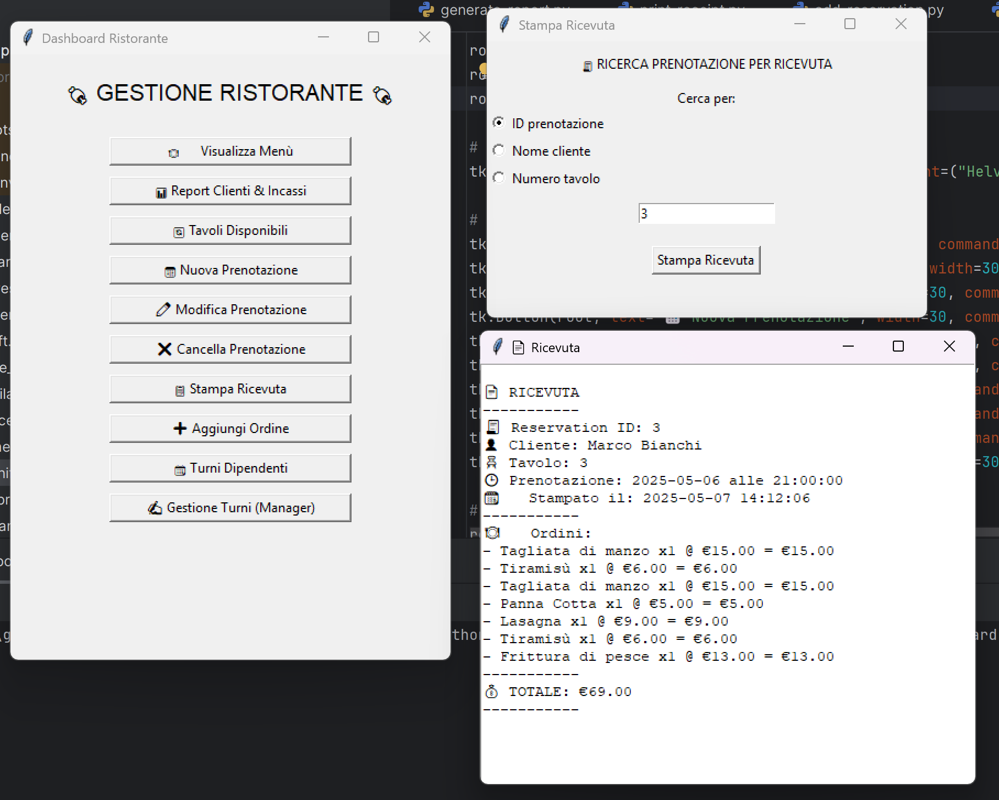

# 🍕 Sistema di Gestione Ristorante – Panoramica

📚 Lingua / Language: [🇮🇹 Italiano (questo file)](#) | [🇬🇧 English](README.md)

Questo progetto è un **Database per la Gestione di un Ristorante** che copre le operazioni essenziali come prenotazioni, ordini, gestione del personale e del menù. Garantisce l'integrità dei dati tramite relazioni strutturate e vincoli.

## Ambito

Il database supporta funzionalità fondamentali per gestire le operazioni di un ristorante in modo efficiente, inclusi:

* **Tables**: Informazioni sui tavoli disponibili.
* **Employees**: Dettagli sul personale e sui ruoli.
* **Shifts**: Turni di lavoro dei dipendenti.
* **Reservations**: Gestione delle prenotazioni dei clienti.
* **Menu**: Piatti con prezzi e disponibilità.
* **Orders**: Registri degli ordini dei clienti.
* **Cash Register**: Registra i conti emessi.

### Fuori dall'ambito

* Report finanziari entrata/uscita
* Gestione del magazzino fornitori
* Programmi fedeltà clienti

## Requisiti Funzionali

* **Gestione Tavoli**: Aggiunta, modifica e rimozione tavoli.
* **Gestione Dipendenti**: Aggiunta/modifica/rimozione del personale e assegnazione dei turni.
* **Gestione Prenotazioni**: Creazione, aggiornamento, cancellazione e conferma prenotazioni.
* **Gestione Ordini**: Tracciamento ordini e calcolo totale.
* **Programmazione Turni**: Assegnazione dei turni ai dipendenti.
* **Disponibilità Tavoli in Tempo Reale**: Verifica immediata.
* **Report Vendite e Prestazioni**: Generazione report vendite e personale.

---

## Diagramma Entità-Relazioni

---

## ⚙️ Tipologie di Azioni & Frequenze Stimate

| Azione                   | Tipo        | Frequenza Stimata |
| ------------------------ | ----------- | ----------------- |
| Fare una prenotazione    | Interattiva | 50–100/giorno     |
| Controllare orari lavoro | Interattiva | 2–3/giorno        |
| Effettuare un ordine     | Interattiva | 200–300/giorno    |
| Generare un conto        | Interattiva | \~200/giorno      |
| Aggiornare un piatto     | Batch       | 200–300/giorno    |
| Annullare prenotazione   | Interattiva | \~10/giorno       |
| Creare turno (manager)   | Interattiva | 1–2/settimana     |

---

## 🧹 Eliminazione delle Generalizzazioni

Per l'entità **Employee**, si è deciso di unificare le entità figlie poiché i pattern di accesso per le relazioni legate ai turni non sono distinti.

---

## 🧲 Analisi delle Ridondanze

Gli attributi **TotalAmount** e **OrderAmount** possono essere derivati da altre entità:

* `OrderAmount` si calcola come somma di `(quantità × prezzo)` per ogni piatto.
* `TotalAmount` è la somma di tutti gli `OrderAmount` per tavolo.

Con una media di 200 ordini/giorno e 20 prodotti per ordine, ogni tavolo (3 ordini) potrebbe arrivare a 60 piatti. Calcolare `TotalAmount` richiede solo la somma di `OrderAmount`, quindi **manteniamo `OrderAmount`** ma **eliminiamo `TotalAmount`** per semplicità computazionale.

### ✅ Conclusione

Si **mantiene l'attributo `OrderAmount`**, anche se viola la **Terza Forma Normale (3NF)**,
e si **elimina `TotalAmount`**, calcolabile dinamicamente in fase di stampa.

## Diagramma ER Aggiornato

---

# 🍽️ Dettaglio Modello ER

## 📦 Tabelle Entità

| Entità              | Attributi Principali                                                                                                                          |
| ------------------- | --------------------------------------------------------------------------------------------------------------------------------------------- |
| **TableRestaurant** | `TableID (PK)`, `Seats`, `Location`, `Status`                                                                                                 |
| **Employee**        | `EmployeeID (PK)`, `Password`, `FirstName`, `LastName`, `Phone`, `Email`, `Role`                                                              |
| **Shift**           | `ShiftID (PK)`, `StartTime`, `EndTime`, `Date`                                                                                                |
| **EmployeeShift**   | `EmployeeID (FK)`, `ShiftID (FK)`                                                                                                             |
| **MenuItem**        | `ItemID (PK)`, `Name`, `Description`, `Price`, `Availability`                                                                                 |
| **Reservation**     | `ReservationID (PK)`, `CustomerName`, `CustomerPhone`, `Email`, `Date`, `Time`, `NumberOfGuests`, `Status`, `TableID (FK)`, `EmployeeID (FK)` |
| **OrderRestaurant** | `OrderID (PK)`, `TableID (FK)`, `EmployeeID (FK)`, `OrderTime`, `OrderAmount`                                                                 |
| **Contains**        | `OrderID (FK)`, `ItemID (FK)`, `Quantity`                                                                                                     |
| **CashRegister**    | `BillID (PK)`, `OrderID (FK)`, `BillTime`, `TotalAmount`, `CashierID (FK)`                                                                    |

---

## 🔗 Tabelle Relazioni

| Relazione            | Entità Coinvolte                  | Descrizione                                                      |
| -------------------- | --------------------------------- | ---------------------------------------------------------------- |
| **AssignedToShift**  | Employee ↔ Shift                  | Un dipendente può essere assegnato a più turni (`EmployeeShift`) |
| **MakesReservation** | Employee ↔ Reservation            | Un dipendente è responsabile della prenotazione                  |
| **ReservationTable** | TableRestaurant ↔ Reservation     | Una prenotazione è associata a un tavolo specifico               |
| **ReceivesOrder**    | TableRestaurant ↔ OrderRestaurant | Un tavolo può ricevere più ordini                                |
| **TakesOrder**       | Employee ↔ OrderRestaurant        | Un dipendente prende l'ordine                                    |
| **ContainsItem**     | OrderRestaurant ↔ MenuItem        | Un ordine contiene uno o più piatti (`Contains`)                 |
| **GeneratesBill**    | OrderRestaurant ↔ CashRegister    | Un ordine genera un conto                                        |
| **HandledBy**        | CashRegister ↔ Employee           | Ogni conto è gestito da un dipendente cassiere                   |

---

## Schema Logico

---

## Ottimizzazioni

### Funzioni Python

* `get_available_tables`: Mostra i tavoli disponibili.
* `show_menu`: Mostra piatti con id, nome, descrizione, prezzo, disponibilità.
* `show_shift`: Migliora la gestione dei turni.
* `generate_report`: Mostra report entrate e clienti in un periodo.
* `print_recipe`: Stampa il conto di una prenotazione.
* `add_reservation`: Aggiunge una nuova prenotazione con tavoli liberi.
* `edit_reservation`: Modifica prenotazione controllando disponibilità.
* `delate_reservation`: Cancella una prenotazione.
* `edit_shift`: Modifica o crea un turno (solo manager).

L'utilizzo di **prepared statements** con Python grazie a `conn=get_connection()`, `conn.autocommit = False`, `conn.commit()` e `conn.rollback()`
permette di **gestire le transazioni** e garantire le **proprietà ACID**.

### Visite (Views)

* **AvailableTables**: Disponibilità tavoli in tempo reale.
* **DailySales**: Ricavi giornalieri.
* **EmployeeShift**: Assegnazioni dei turni.

Si è infine deciso di **non usare le viste**, a causa dei costi di aggiornamento dovuti alla continua variazione dei dati correlati.

## Limitazioni

* Presuppone relazioni lineari (problemi di scalabilità).
* Nessuna gestione posti flessibili.
* Nessun supporto per modifiche personalizzate ai piatti.
* Un dipendente non può avere più ruoli nello stesso turno.

## Anteprima Interfaccia Grafica

---

### Stampa Ricevuta

**Autore**: Nicola Gigante
