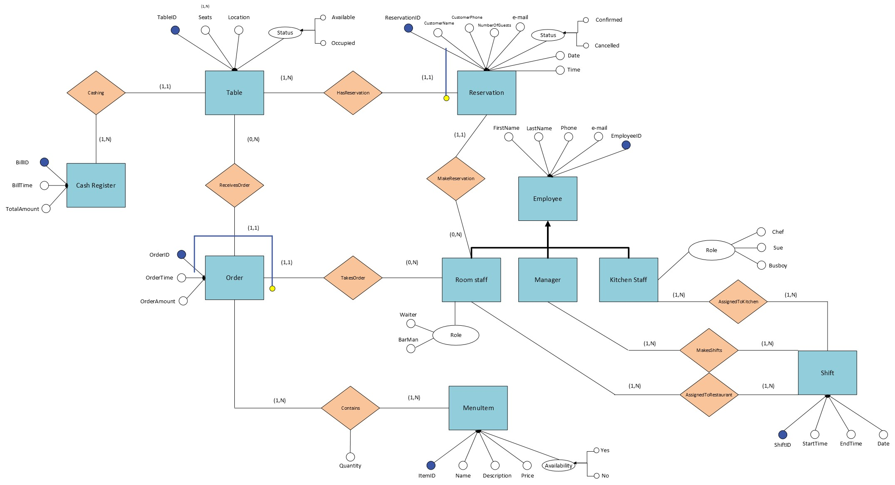
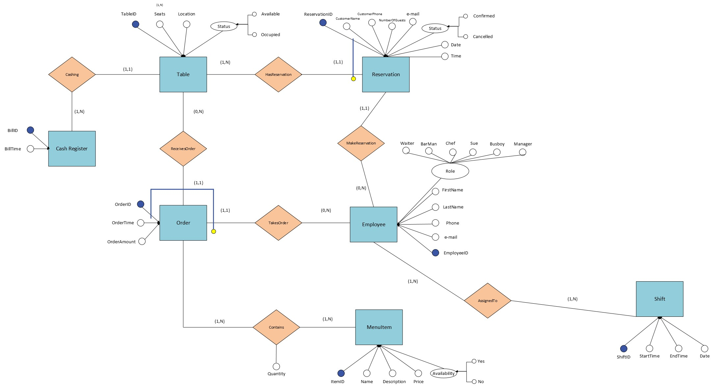
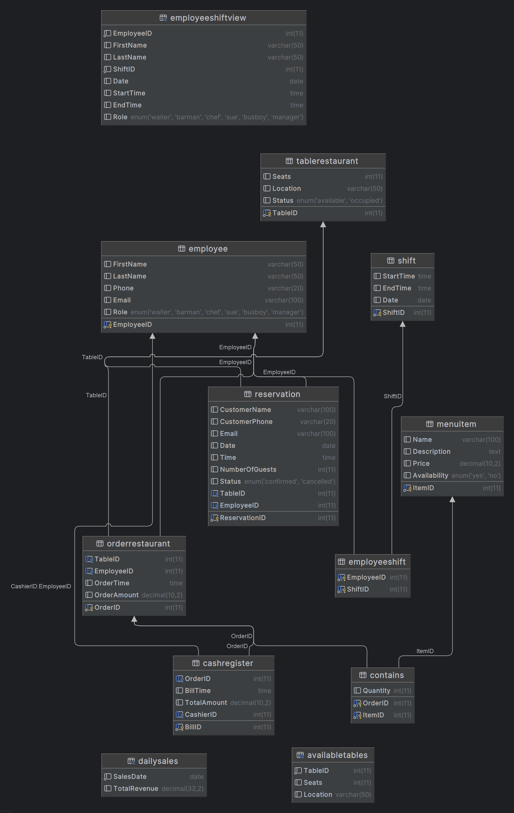
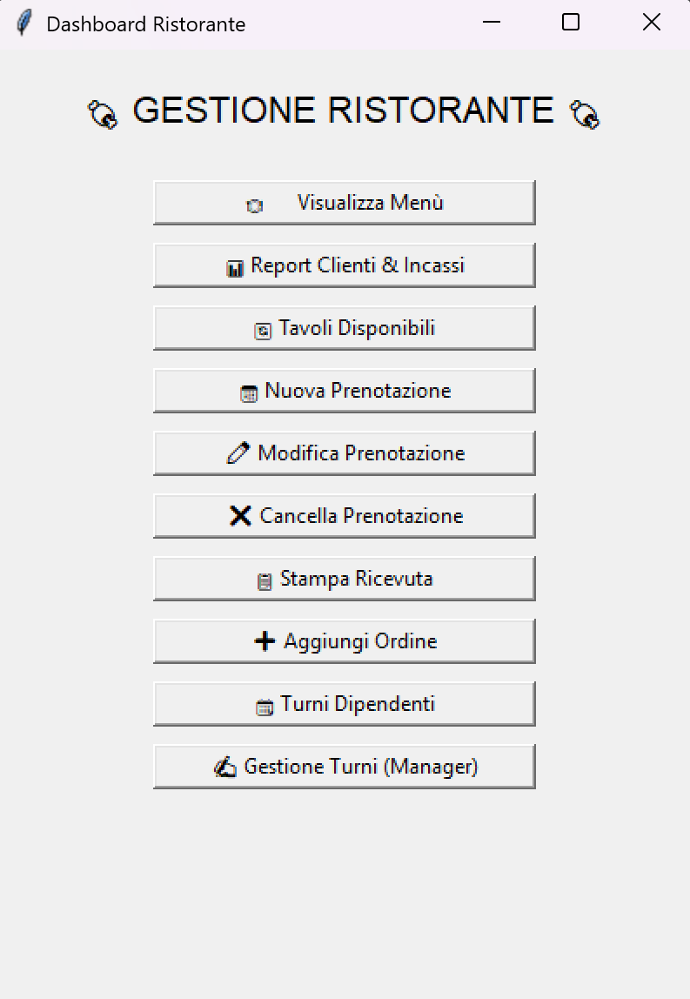
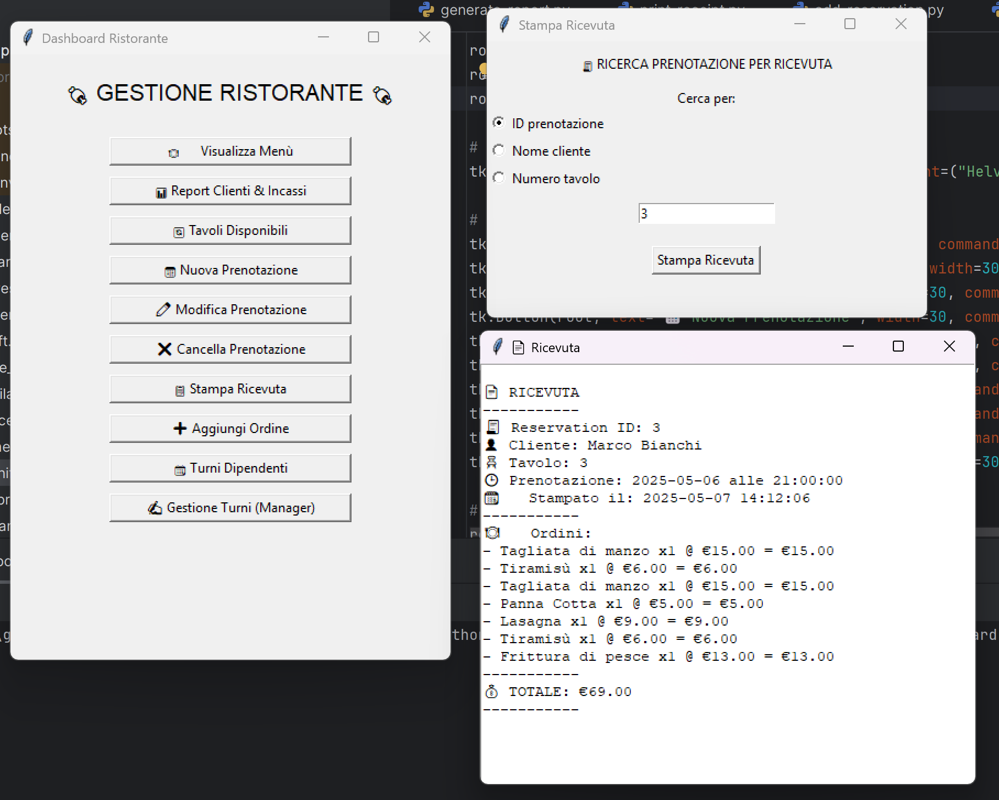

# 🍕 Restaurant Management System Database – Overview

📚 Lingua / Language: [🇮🇹 Italiano](README.it.md) | [🇬🇧 English (this file)](#)

This project is a **Restaurant Management System Database** design that covers essential operations such as reservations, orders, employees, and menu management. It ensures data integrity through structured relationships and constraints.

## Scope

The database supports core functionalities to manage restaurant operations efficiently, including:

- **Tables**: Information about dining tables.
- **Employees**: Staff details and roles.
- **Shifts**: Employee work schedules.
- **Reservations**: Customer reservation tracking.
- **Menu**: Menu items with pricing and availability.
- **Orders**: Customer order records.
- **Cash Register**: Keep record of bills.

### Out of Scope

- Financial reports(in-out)
- Supplier inventory management
- Customer loyalty programs

## Functional Requirements

- **Manage Tables**: Add, update, and remove tables.
- **Employee Management**: Add/update/remove employee details and assign shifts.
- **Handle Reservations**: Create, update, cancel, and confirm reservations.
- **Order Management**: Track customer orders and calculate totals.
- **Shift Scheduling**: Assign employees to shifts.
- **Real-Time Table Availability**: Check table availability.
- **Sales and Performance Tracking**: Generate sales and employee reports.

---

## Entity-Relationsip Diagram

---
## ⚙️ Action Types & Frequency Estimates

| Action                     | Type        | Frequency Estimate       |
|----------------------------|-------------|---------------------------|
| Make a reservation         | Interactive | 50–100/day                |
| Check working hours        | Interactive | 2–3/day                   |
| Place an order             | Interactive | 200–300/day               |
| Generate bill              | Interactive | ~200/day                  |
| Update menu item quantity  | Batch       | 200–300/day               |
| Cancel reservation         | Interactive | ~10/day                   |
| Create shift (manager)     | Interactive | 1–2/week                  |

---

## 🧹 Elimination of Generalizations

Regarding the **Employee** entity, it was decided to merge the child entities since the access patterns for shift-related relationships are not distinct.  

---

## 🧮 Redundancy Analysis

**TotalAmount** and **OrderAmount** are attributes that can be derived from other entities:  
- `OrderAmount` can be computed as the sum of `(quantity × price)` for each item in an order.  
- `TotalAmount` can be calculated as the sum of all `OrderAmount` values indexed by table.

It is estimated that an order can be placed **200 times per day**, and each order may contain around **20 products**.  
In the worst-case scenario (20 distinct products per order), with an average of **3 orders per table (reservation)**, there would be up to **60 products** per table.  
To compute the `TotalAmount`, each product must be multiplied by its unit price and the results summed.

Therefore, **keeping the `OrderAmount` attribute** simplifies the calculation of `TotalAmount`, as only a simple sum is required.  
On the other hand, **storing `TotalAmount` becomes unnecessary**, since its calculation has already been simplified via `OrderAmount`.

### ✅ Summary

We **keep the `OrderAmount` attribute**, even at the cost of violating **Third Normal Form (3NF)**,  
and **eliminate the `TotalAmount` attribute**, which will instead be calculated dynamically at the moment of receipt printing.

## Renovated Entity-Relationsip Diagram

---

# 🍽️ Restaurant Management System – ER Model Breakdown

## 📦 Entity Tables

| Entity              | Main Attributes                                                                                                                               |
| ------------------- | --------------------------------------------------------------------------------------------------------------------------------------------- |
| **TableRestaurant** | `TableID (PK)`, `Seats`, `Location`, `Status`                                                                                                 |
| **Employee**        | `EmployeeID (PK)`, `Password`, `FirstName`, `LastName`, `Phone`, `Email`, `Role`                                                                          |
| **Shift**           | `ShiftID (PK)`, `StartTime`, `EndTime`, `Date`                                                                                                |
| **EmployeeShift**   | `EmployeeID (FK)`, `ShiftID (FK)`                                                                                                             |
| **MenuItem**        | `ItemID (PK)`, `Name`, `Description`, `Price`, `Availability`                                                                                 |
| **Reservation**     | `ReservationID (PK)`, `CustomerName`, `CustomerPhone`, `Email`, `Date`, `Time`, `NumberOfGuests`, `Status`, `TableID (FK)`, `EmployeeID (FK)` |
| **OrderRestaurant** | `OrderID (PK)`, `TableID (FK)`, `EmployeeID (FK)`, `OrderTime`, `OrderAmount`                                                                 |
| **Contains**        | `OrderID (FK)`, `ItemID (FK)`, `Quantity`                                                                                                     |
| **CashRegister**    | `BillID (PK)`, `OrderID (FK)`, `BillTime`, `TotalAmount`, `CashierID (FK)`                                                                    |
---

## 🔗 Relationship Tables

| Relationship         | Entities Involved                 | Description                                                      |
| -------------------- | --------------------------------- | ---------------------------------------------------------------- |
| **AssignedToShift**  | Employee ↔ Shift                  | An employee can be assigned to multiple shifts (`EmployeeShift`) |
| **MakesReservation** | Employee ↔ Reservation            | An employee is responsible for creating a reservation            |
| **ReservationTable** | TableRestaurant ↔ Reservation     | A reservation is associated with a specific table                |
| **ReceivesOrder**    | TableRestaurant ↔ OrderRestaurant | A table can receive multiple orders                              |
| **TakesOrder**       | Employee ↔ OrderRestaurant        | An employee takes the order                                      |
| **ContainsItem**     | OrderRestaurant ↔ MenuItem        | An order contains one or more menu items (`Contains`)            |
| **GeneratesBill**    | OrderRestaurant ↔ CashRegister    | An order results in a bill at the cash register                  |
| **HandledBy**        | CashRegister ↔ Employee           | Each bill is handled by a cashier (employee)                     |
---

## Logic Schema

---

#
## Optimizations

### Python functions

- `get_available_tables`: Shows the avaiable tables.
- `show_menu`: Show the items (id, name, description, price, avaiability).
- `show_shift (singular or all)`: Enhances scheduling.
- `generate_report`: Show incomes reports and clients turnout in a specific period.
- `print_recipe`: Print the bill of a specific reservation.
- `add_reservation`: Adds a new reservation giving the free tables for a specific date and time.
- `edit_reservation`: Modify a reservetion checking the avaiability of the tables.
- `delate_reservation`: Delete resrvation.
- `edit_shift`: Modify or insert a Shift (for manager only).

Note that the use of prepared statments compiled with python implies thanks to the functions `conn=get_connection()`, `conn.autcomit = False`, `conn.commit()` and `conn.rollback()`; to automatically use the transactions that guarantee `ACID propieties`.

### Views

- **AvailableTables**: Provides real-time table availability.
- **DailySales**: Summarizes daily revenue.
- **EmployeeShift**: Provides employees assignments

It is finally decided not to use views because of the unnecessary cost of updating them, caused by the continuous and possible updating of the tables to which they relate.

## Limitations

- Assumes linear relationships (scalability concerns for large datasets).
- No flexible seating arrangements.
- No support for custom menu modifications.
- Employees cannot hold multiple roles in the same shift.

## UI overview

---

### Printing recipt

**Author**: Nicola Gigante
