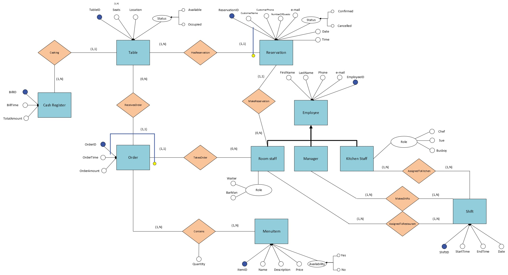
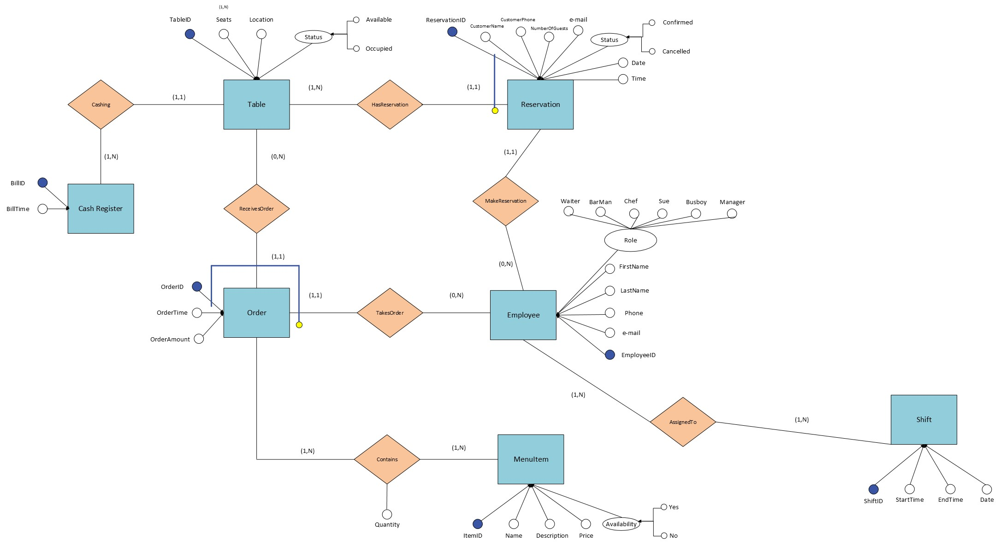

# Restaurant Management System Database – Overview

This project is a **Restaurant Management System Database** design that covers essential operations such as reservations, orders, employees, and menu management. It ensures data integrity through structured relationships and constraints.

## Scope

The database supports core functionalities to manage restaurant operations efficiently, including:

- **Tables**: Information about dining tables.
- **Employees**: Staff details and roles.
- **Shifts**: Employee work schedules.
- **Reservations**: Customer reservation tracking.
- **Menu**: Menu items with pricing and availability.
- **Orders**: Customer order records.
- **Cash Register**: Keep record of bills.

### Out of Scope

- Financial reports(in-out)
- Supplier inventory management
- Customer loyalty programs

## Functional Requirements

- **Manage Tables**: Add, update, and remove tables.
- **Employee Management**: Add/update/remove employee details and assign shifts.
- **Handle Reservations**: Create, update, cancel, and confirm reservations.
- **Order Management**: Track customer orders and calculate totals.
- **Menu Management**: Add, update, and remove menu items.
- **Shift Scheduling**: Assign employees to shifts.
- **Real-Time Table Availability**: Check table availability.
- **Sales and Performance Tracking**: Generate sales and employee reports.

---

## Entity-Relationsip Diagram

---

## Renovated Entity-Relationsip Diagram

---

# 🍽️ Restaurant Management System – ER Model Breakdown

## 📦 Entity Tables

| Entity       | Attributes                                                                 |
|--------------|----------------------------------------------------------------------------|
| **Table**        | TableID (PK), Seats, Location, Status (Available / Occupied)               |
| **Room staff**   | RSID (PK), FirstName, LastName, Phone, Email, Role                     |
| **Kitchen staff**| KSID (PK), FirstName, LastName, Phone, Email, Role                     |
| **Manager**      | ManagerID (PK), FirstName, LastName, Phone, Email                      |
| **Shift**        | ShiftID (PK), StartTime, EndTime, Date                                    |
| **Reservation**  | ReservationID (PK), CustomerName, CustomerPhone, Email, Date, Time, NumberOfGuests, Status (Confirmed / Cancelled) |
| **Order**        | OrderID (PK), TableID (FK), EmployeeID (FK), OrderTime, OrderAmount       |
| **MenuItem**     | ItemID (PK), Name, Description, Price, Availability (Yes / No)            |
| **Cash Register**         | BillID (PK), OrderID (FK), BillTime, TotalAmount                 |

---

## 🔗 Relationship Tables

| Relationship            | Composition                 | Description                                                                 |
|-------------------------|-----------------------------|-----------------------------------------------------------------------------|
| **HasReservation**      | ReservationID, TableID      | A table can have multiple reservations, but one reservation is linked to only one table. |
| **MakeReservation**     | ReservationID, RSID         | An employee can make multiple reservations, but one reservation is made by one employee. |
| **ReceivesOrder**       | OrderID, TableID            | A table can receive multiple orders, but one order is made for one table. |
| **TakesOrder**          | OrderID, RSID               | An employee takes multiple orders, but one order is made by one employee. |
| **Contains**            | OrderID, ItemID, Quantity   | An order can contain multiple items, multiple elements can appear in multiple orders.|
| **AssignedToKitchen**   | KSID, ShiftID               | Kitchen staff assigned to kitchen shifts.                                   |
| **AssignedToRestaurant**| RSID, ShiftID               | Room staff assigned to restaurant shifts.                                   |
| **MakesShifts**         | ManagerID, ShiftID          | Managers are responsible for shift creation.                                |
| **Cashing**             | BillID, RSID                | An employee handles the bill.                               |
                        

---

## ⚙️ Action Types & Frequency Estimates

| Action                     | Type        | Frequency Estimate       |
|----------------------------|-------------|---------------------------|
| Make a reservation         | Interactive | 50–100/day                |
| Check working hours        | Interactive | 2–3/day                   |
| Place an order             | Interactive | 200–300/day               |
| Generate bill              | Interactive | ~200/day                  |
| Update menu item quantity  | Batch       | 200–300/day               |
| Cancel reservation         | Interactive | ~10/day                   |
| Create shift (manager)     | Interactive | 1–2/week                  |

---

#
## Optimizations

### Indexes

- `check_table_number`: Speeds up table availability checks.
- `check_reservation_datetime`: Optimizes reservation searches.
- `filter_employee_role`: Improves role-based filtering.
- `check_shift_date & check_order_date`: Enhances scheduling and sales reports.

### Views

- **AvailableTables**: Provides real-time table availability.
- **DailySales**: Summarizes daily revenue.
- **EmployeeShift**: Provides employees assignments

## Limitations

- Assumes linear relationships (scalability concerns for large datasets).
- No flexible seating arrangements.
- No support for custom menu modifications.
- Employees cannot hold multiple roles in the same shift.

##

**Author**: Nicola Gigante
